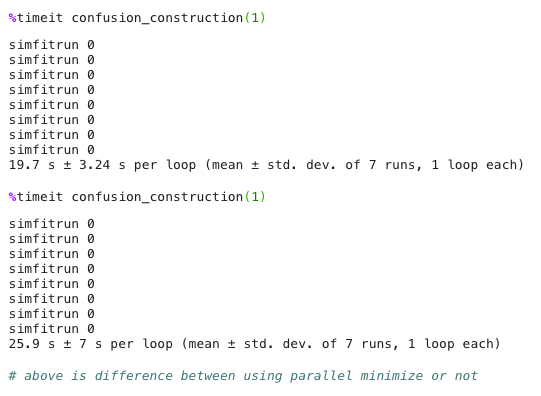
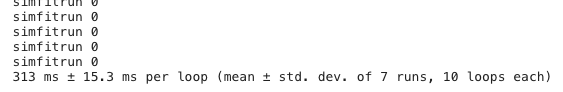

# benchmark before and after numba

so, this is comparing one "simfitrun" where we use the optimparallel package for fit_m5RWCK_v1:

oen simfitrun is, as seen in figure5_confusionmatrix, simulating model1, then fitting models1-5, then simulating model2, fitting models2-5 and so on.

matlab could do 100 of these in 5-10 minutes or so. and i didn't want to have to wait 30 mins to have 100 runs so i could compare and see that i get similar results.

## enter numba

that's... ... uhmm... faster.
